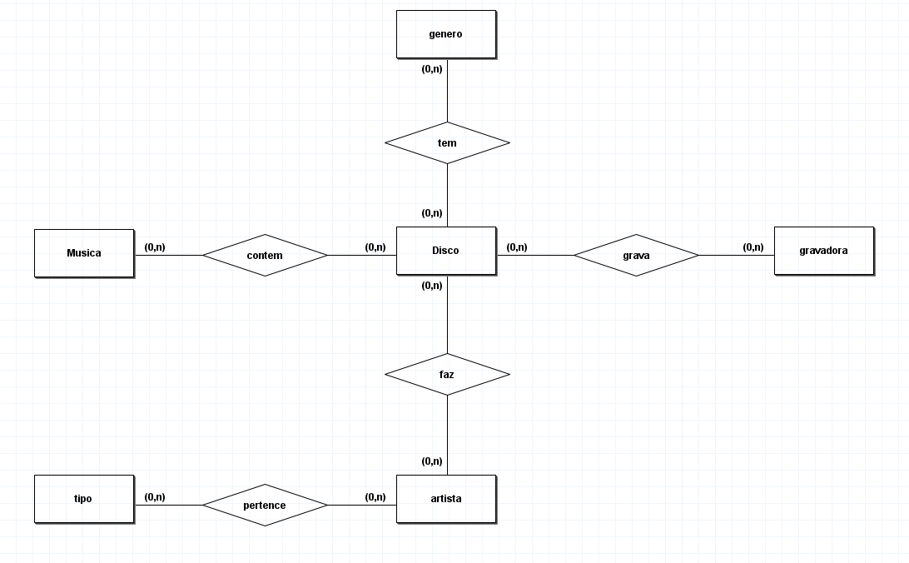
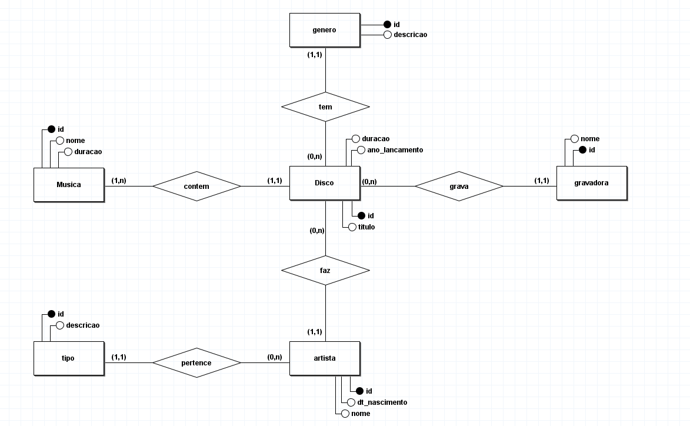
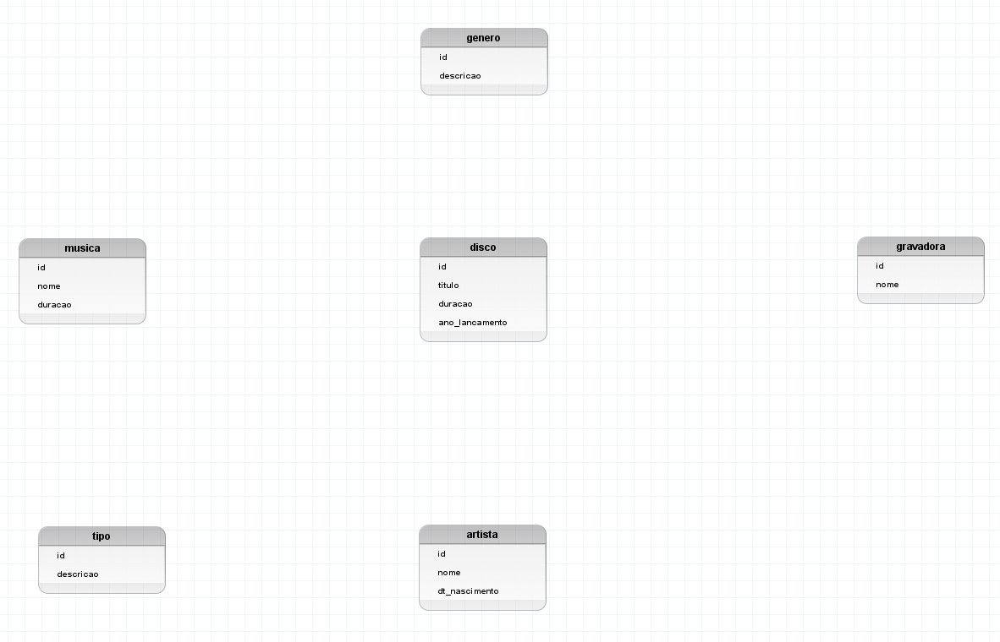
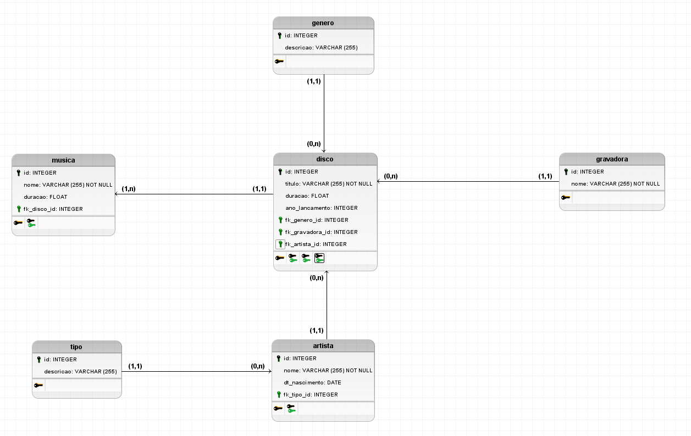

# Banco de dados de uma disoteca 

## Regra de negócio/Requisitos

​	Uma discoteca gostaria de catalogar sua coleção, e para isso contratou uma empresa pequena para criar seu sistema. Após uma longa entrevista com o analista de requisitos o mesmo chegou na seguinte regra de negocio relevante para o dono da discoteca. Todos os seus discos devem conter id, titulo, duração, ano de lançamento, o artista, e a gravadora que produziu e publicou cada disco, sendo que é relevante saber também quais são as musicas de cada disco e seu gênero musical, entenda como artista a banda, o conserto, a dupla ou o artista solo, porém para artistas solo deve-se saber além do nome a sua data de nascimento, ja para as musicas é necessário saber o nome e tempo de duração. As musicas somente podem estar em um único disco e nenhum disco deve ser cadastrado sem suas musicas, gravadoras podem ser cadastradas mesmo que não possuam discos associados a ela. Deve ser possível registrar artistas sem disco e o disco deve conter apenas um artista associado a ele.

​	Você é o responsavel pelo banco de dados, gere um documento contendo o MER e DER, sendo que sobre o DER se torna necessario o nivel conceitual e lógico do banco. Seu documento deve conter separadamente em versões:

## Conceitual

- 1.0 (apenas relações com seus atributos, sem cardinalidades estabelecidas)
- 1.1 (aplicação dsa cardinalidades presentes)
- 1.2 (desmembramentos de relações n:n)

## Lógico

- 1.0 (sem tipicação dos campos)
- 1.1 (agregação de tipos e restrições)

## Fisíco

Anexe o script sql responsavel pela geração do banco de dados proposto por você a equie de TI.

## Carga de dados

___Procure por dados reais___

Gere um script separado para a carga de dados para o teste de extres do banco de dados, devemos ter:

- 5 gravadoras distintas
- 10 discos para cada gravadora
- minimo de 7 e maximo de 10 musicas por disco. (não podendo conter apenas a masma quantidade)
- devemos ter pelo menos 30 artistas diferentes
- os artivas devem ser dos mais variados possiveis (banda, o conserto, a dupla ou o artista solo,)

## entrega da atividade:

### conceitual

### Lógico

### Fisíco
[Clique aqui](Discoteca.sql)
